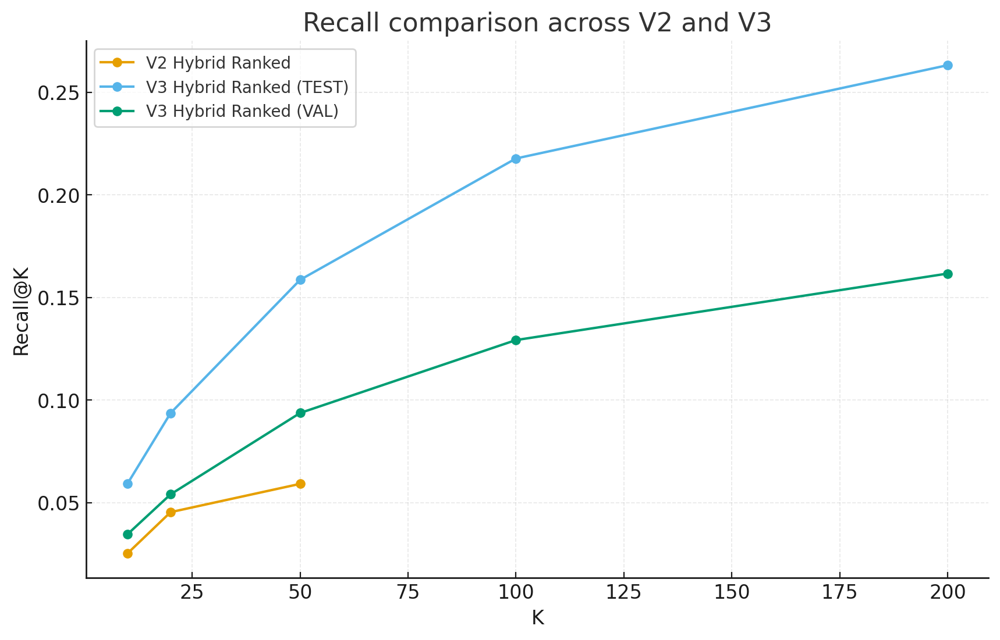
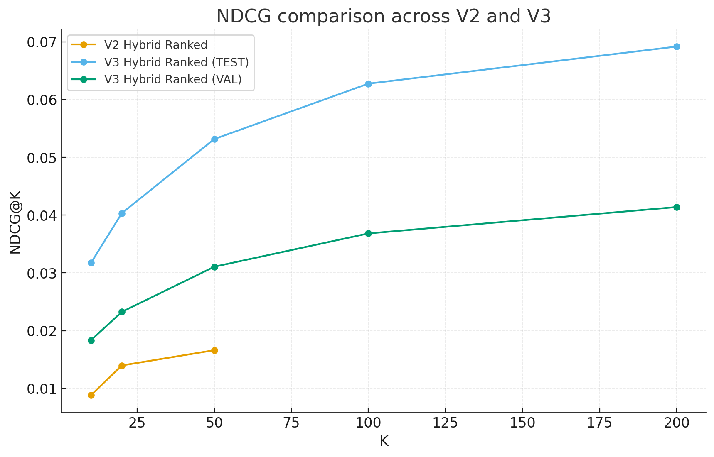

# 🎬 Movie Recommendation MVP

A hands-on, locally runnable, **end-to-end recommender systems playground** that evolves from classic baselines to a **Netflix-inspired hybrid stack** with neural retrieval, sequence modeling, candidate blending, learning-to-rank, and a lightweight **online feedback loop**.

This repository is intentionally engineered as a **learning-grade but production-shaped** system:
- clear module boundaries  
- reproducible offline evaluation  
- service + UI wiring  
- explicit trade-offs vs. Netflix/Amazon scale

---

## ✅ What this README includes (final scope checklist)

This final README version covers everything we finalized from **V1 to V3 (8.6.2)**, plus supporting artifacts:

### Product story & positioning
- 🎯 Problem framing and what “good” looks like
- 🧭 Why this architecture is different from generic toy recommenders
- 🆚 Explicit comparison to **Netflix** and **Amazon Prime Video**

### System architecture (V1 → V2 → V3)
- 🧱 Component-by-component evolution
- 🔁 Candidate → Ranker → Explain → Feedback loop
- 🧩 How each model contributes to the final slate

### Evaluation & results
- 📈 Offline ranking metrics you produced in terminal
- 🔍 Interpretation of lifts and what they mean
- ⚠️ Known evaluation limitations in a local MVP setup

### Service + UI (8.6.2)
- 🚀 API contracts: `/recommend`, `/feedback`
- 🖥️ Streamlit UX behavior and Netflix-like sections
- 🧠 “Why this” lightweight explanation rules

### Gaps & future roadmap
- 🧨 The “serious gaps” list you enumerated
- 🧪 How we bridge them in V4+ style work (conceptually)

---

## 🌟 High-level vision

Most small recommendation demos stop at:
- one algorithm
- no candidate/ranker split
- no explainability
- no online loop

This project does **not**.

Instead, it deliberately mimics the *shape* of a modern large-scale system:

1. **Multiple candidate generators**
2. **Blended retrieval priors**
3. **Re-ranking with consistent feature contracts**
4. **Reason generation**
5. **A feedback loop that changes future results**

Even in local constraints, the architecture is designed to be an honest blueprint for core Netflix/Amazon patterns.

---

## 🧠 Architecture at a glance (V3)

```
User Events (ratings/implicit) 
        │
        ▼
Confidence Builder (train/val/test splits)
        │
        ├───────────────┬───────────────────────────┬──────────────────────┐
        ▼               ▼                           ▼                      ▼
V2 CF Priors      Two-Tower Retrieval         GRU Sequence Model     Popular/Genre priors
(item-item/user)  (user/item embeddings)      (next-item intent)     (fallback + cold-ish)
        │               │                           │                      │
        └───────────────┴──────────────┬────────────┴──────────────────────┘
                                       ▼
                           V3 Candidate Blending
                        (ANN base + optional SEQ/V2)
                                       │
                                       ▼
                         V3 Pointwise Ranker (HGB)
                 (blend_score + source flags + user/item features)
                                       │
                                       ▼
                         Recommendation Service + API
                                       │
                                       ▼
                            Streamlit “Netflix-like UI”
                                       │
                                       ▼
                            Feedback events (/feedback)
                           influencing future refresh
```

---

## 🧪 Model evolution

### V1 — Foundations
**What we aimed to prove:**
- A clean, reproducible offline pipeline
- Baselines that are easy to reason about
- A simple service + UI

**Core building blocks:**
- Popularity priors  
- Genre-based heuristics  
- Item-item collaborative signals  

This stage was about *correctness, data hygiene, and confidence logic*, not sheer metric wins.

---

### V2 — Hybrid candidate ranking
**What changed:**
- Unified V2 feature table  
- Hybrid candidate pool  
- A learned ranker with locked feature order  

**Why it mattered:**
This introduced the **candidate → ranker split** that almost all serious systems rely on.

**Your best V2 ranked snapshot (after fixes):**
- Recall@10 ≈ **0.0253**
- Recall@20 ≈ **0.0454**
- Recall@50 ≈ **0.0592**

This was the first moment the system started behaving like a layered recommender rather than a single-model script.

---

### V3 — Neural + Sequence + Proper blended retrieval
V3 adds three major ideas that are table-stakes in modern platforms:

1. **Two-Tower / ANN retrieval**  
2. **Sequence intent modeling (GRU)**  
3. **Blended candidate priors** feeding a **V3 ranker**

**Why this makes V3 feel “Netflix-like”:**
- retrieval is no longer purely co-occurrence  
- **embedding space** lets you generalize beyond exact overlaps  
- sequence intent gives a “what you watched recently” flavor

---

## 📈 Results you produced

### Offline ranking comparison

**Recall@K**


**NDCG@K**


**Key takeaway:**
- V3 shows a meaningful lift over V2, especially at higher K
- The system benefits from **multi-source candidate diversity**
- The ANN + sequence blend gives the ranker more “good stuff” to choose from

---

## 🧾 V3 VAL vs TEST evaluation notes

You ran both:
- a **VAL-aligned V3 ranker**  
- a **TEST-side symmetric pipeline**

This is excellent engineering discipline because it:
- ensures no accidental leakage of assumptions  
- preserves **dataset symmetry**  
- keeps the local experimentation honest

---

## 🧩 Candidate sources and how the ranker sees them

In V3 pointwise features, we explicitly encode:

- `blend_score`
- `has_tt` (Two-Tower ANN)
- `has_seq` (GRU)
- `has_v2` (V2 CF priors)
- user-level stats
- item-level stats

This makes the ranker **source-aware**, enabling it to learn:
- “when sequence is a better signal”
- “when embeddings are strong”
- “when popularity priors rescue sparse users”

---

## 🧠 “Why this” explanation (V3 service)

We implemented lightweight explanations for UI clarity:

- If `has_seq == 1`  
  **reason** = “Because you watched X recently”
- Else if `has_tt == 1`  
  **reason** = “Similar to your taste”
- Else if `has_v2 == 1`  
  **reason** = “Popular among similar users”
- Otherwise  
  **reason** = “Trending now”

This is intentionally simple, but mirrors how real systems often start:
**rule-based explanation on top of model signals**.

---

## 🔁 V3 feedback loop (8.6.2)

### What we wired
- ✅ `/recommend` returns ranked slate + reasons + optional posters
- ✅ `/feedback` ingests:
  - `like`
  - `watched`
  - `skip` (if enabled in your UI version)
- ✅ Service stores a lightweight local state to:
  - boost or down-rank near-term results
  - surface category headings in UI

### Why this matters
Without feedback, a UI looks static even with great models.
With feedback, the product begins to feel alive.

---

## 🌈 Streamlit UI — Netflix-like sections

The V3 UI is expected to render **separate horizontal sections**:

- 🔥 **Popular right now**
- 🧬 **Similar to your taste**
- ⏭️ **Because you watched …**
- 🧠 **From your recent intent**
- 🧩 **Mixed discovery**

This is a **user-experience layer** on top of a single ranked list.
In real platforms, the *presentation strategy* is as important as the raw model.

---

## 🖼️ Posters support (local-friendly)

Posters are tricky in offline datasets.
For this MVP we support:

1. **Optional poster URL field** if present in `dim_items`  
2. Safe fallback UI (placeholder) when missing

This keeps the UI consistent even when poster coverage is incomplete.

---

## 🆚 How this matches Netflix/Amazon (and where it doesn’t)

### Where we match the *shape*
- ✅ Multi-stage architecture  
- ✅ Candidate blending  
- ✅ Neural retrieval  
- ✅ Sequence intent  
- ✅ Ranker with source-aware features  
- ✅ UI sections + explanations  
- ✅ Feedback loop

### Where we don’t match the *scale*
- ❌ No real-time streaming features  
- ❌ No massive online feature store  
- ❌ No multi-objective / slate-aware ranker  
- ❌ No contractual/licensing constraints  
- ❌ No household maturity controls  
- ❌ No originals-boosting business rules

---

## 🚧 The “serious gaps” list (as finalized)

These remain **explicitly out of scope** for V3 MVP but are your
**Step 8+ / V4 ambition map**:

- Neural/two-tower retrieval at scale  
- Transformer-based sequence candidate generators  
- Production-grade ANN infra  
- Content-aware embedding retrieval  
- Real-time event ingestion  
- Streaming feature computation  
- Near-real-time embedding refresh  
- Multi-layer caches + online stores  
- Multi-objective rankers  
- Listwise/pairwise LTR at scale  
- Deep rankers blended with GBDTs  
- Calibration by segment  
- Slate-level diversity constraints  
- Originals boosting  
- Licensing/regional rules  
- Maturity ratings & household controls  

---

## 🧪 How to run (V3 quick path)

> This assumes your local data and earlier steps are complete.

### 1) Train and export models
```bash
python -m src.neural.data_prep
python -m src.sequence.data_prep
python -m src.neural.train_two_tower_v3
python -m src.neural.export_embeddings_v3
python -m src.neural.ann_build_hnsw_v3
python -m src.sequence.train_gru_v3
```

### 2) VAL pipeline
```bash
python -m src.ranking.export_v2_candidates_val
python -m src.neural.ann_generate_candidates_val_v3
python -m src.sequence.generate_candidates_v3
python -m src.ranking.blend_candidates_v3_val
python -m src.ranking.train_ranker_v3_val
python -m scripts.eval_ranked_candidates_v3
```

### 3) TEST pipeline (8.6)
```bash
python -m scripts.make_v3_test_pipeline
```

### 4) Run API + UI
```bash
uvicorn src.service.api_v3:app --reload --port 8003
streamlit run ui/streamlit_app.py
```

---

## 🔌 API contracts (V3)

### GET `/recommend`
**Query params**
- `user_idx: int`
- `k: int` (guarded by API; adjust if you changed limits)
- `include_titles: bool`
- `debug: bool`

**Response (conceptual)**
```json
{{
  "user_idx": 9764,
  "k": 20,
  "version": "v3",
  "items": [
    {{
      "item_idx": 123,
      "title": "Example Movie (2014)",
      "score": 0.87,
      "section": "Because you watched",
      "reason": "Because you watched X recently",
      "poster_url": null,
      "sources": ["two_tower_ann", "sequence_gru"]
    }}
  ]
}}
```

### POST `/feedback`
**Body**
```json
{{
  "user_idx": 9764,
  "item_idx": 123,
  "event": "like"
}}
```

---

## 🧯 Known limitations (honest MVP notes)

- The two-tower model is trained with **capped users/items** for local feasibility.  
- The sequence model only covers users with sufficient history.  
- The V3 blend weights are **hand-tuned** for now.  
- Poster coverage depends on your local dimension tables.  
- This is still a **pointwise ranker**, not listwise or multi-objective.

---

## 🗺️ What’s next (after 8.6.2)

Your logical next steps remain:

1. **V3 → V4 retrieval upgrades**  
   - content-aware embeddings  
   - transformer sequence candidates (SASRec-style)  

2. **True multi-objective ranking**  
   - engagement + retention + novelty + catalog health  

3. **Slate-level optimization**  
   - diversity constraints  
   - session-aware exploration  

4. **Streaming-first architecture**  
   - event ingestion  
   - near-real-time embedding refresh  

---

## 🙌 Closing note

This repo now demonstrates a **credible mini-version of a modern recommender stack**:
not because it matches Netflix scale, but because it respects the **correct architecture, data discipline, evaluation rigor, and product UX patterns** that make Netflix-like systems feel intelligent.

---

### 📎 Included assets
- `recall_v2_v3.png`
- `ndcg_v2_v3.png`

---

**Maintainer:** Deepesh Kumar Gupta  
**Focus:** Product-grade learning systems, not just model demos 🚀
